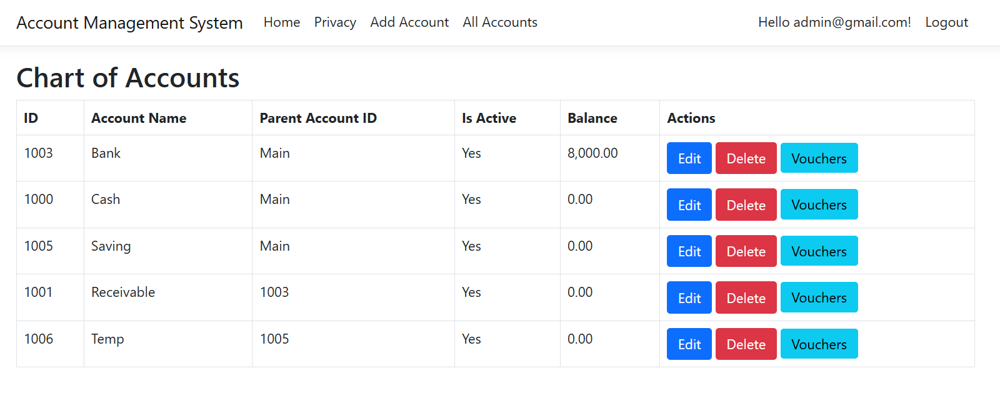
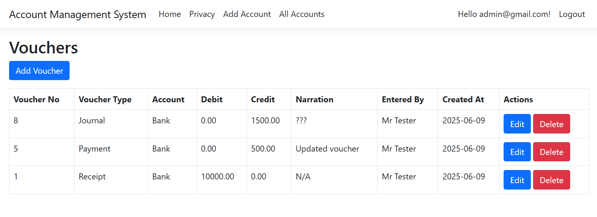
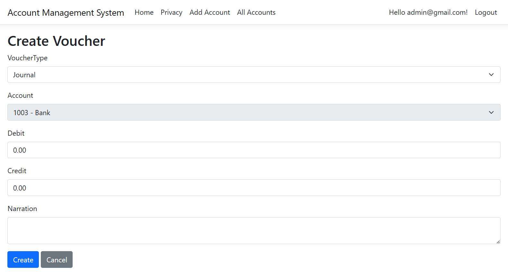

# 🧾 Mini Account Management System

A web-based **Account Management System** built using **ASP.NET Core Razor Pages**, **SQL Server**, and **ASP.NET Identity** with **custom roles**. It supports role-based access, hierarchical chart of accounts, and voucher entries using only **stored procedures** (no LINQ).

## 💻 Tech Stack

- **Frontend**: .NET Core Razor Pages with Bootstrap
- **Backend**: ASP.NET Core with ASP.NET Identity
- **Database**: Microsoft SQL Server using Stored Procedures
- **Design Pattern**: MVC (Model-View-Controller) via Razor Pages
- **ORM**: Entity Framework Core (Only for Identity — No LINQ used elsewhere)
- **Framework**: .NET 8.0

  
## 🚀 Features

- User Authentication and Authorization
- Role-based authorization (`Admin`, `Accountant`, `Viewer`)
- Chart of Accounts with parent-child structure
- Voucher entry for `Journal`, `Payment`, and `Receipt`
- Stored Procedure only (no LINQ or EF queries)
- Live account balance calculation per account
- Restricted access: Viewers can only see their accounts and children

## 🗂️ Project Structure
```
├── Areas/                 # Areas for Identity
├── Data/                  # Database context and configurations
├── Migrations/            # Database migrations
├── Models/                # Data models
│   └── ApplicationUser.cs # Extend identity user
├── Pages/                 # Razor pages
|   ├── ChartOfAccounts/   # Account-related CRUD pages
│   ├── Vouchers/          # Voucher-related CRUD pages
│   └── Shared/            # Layout and shared Razor components
├── Services/              # Business logic and services
├── wwwroot/               # Static files (CSS, JS, images)
├── Program.cs             # Application entry point
└── appsettings.json       # Application configuration
```

## 🛠️ Setup Instructions

### Prerequisites
1. .NET 8.0 SDK
2. SQL Server 2019 or later
4. Visual Studio 2022 or VS Code

### Clone this repository
```bash
   git clone https://github.com/fahimreza71/Account-Management.git
```

### Database Setup
1. Update connection string in `appsettings.json`:
   ```json
   {
     "ConnectionStrings": {
       "DefaultConnection": "Server=(YOUR_SERVER_NAME);Database=AccMgtDB;Trusted_Connection=True;MultipleActiveResultSets=true;TrustServerCertificate=true"
     }
   }
   ```
2. Run migrations: (To extend `IdentityUser` with `ApplicationUser`)
   ```bash
   dotnet ef database update
   ```
3. Copy query from `/Data/SqlScripts/SQLQuery.sql` and execute in Local DB

### Development Setup

```bash
# Restore dependencies
dotnet restore

# Build & Run
dotnet build
dotnet run
```

## ⚠️ Incomplete Features

1. **Incomplete CSS**
   - Current styling is basic and needs improvement
   - Responsive design needs enhancement

3. **Real-time Updates**
   - Currently requires page reload for updates
   - Could implement real-time changes using JavaScript

4. **Identity Features**
   - Login/registration & Role-based authorization implemented
   - Potential improvements:
     - Social media authentication
     - Two-factor authentication
     - Password recovery
     - User profile management

### 🖼️ UI Preview  
<div style="display: flex; justify-content: center;">
  
  
  
  
</div>
